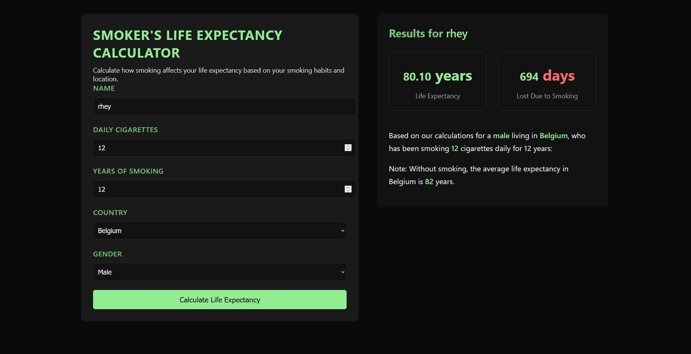

# Smoker's Life Expectancy Calculator


A sophisticated web application that calculates personalized life expectancy based on smoking habits, incorporating country-specific data and gender factors. Built with modern web technologies and an intuitive dark-themed interface.



## 🚀 Quick Setup

### Prerequisites
- Modern web browser (Chrome, Firefox, Safari, or Edge)
- Local development server (Python or Node.js)

### Installation

1. Clone the repository
```bash
git clone https://github.com/yourusername/smokers-life-expectancy-calculator.git
cd smokers-life-expectancy-calculator
```

2. Project Structure
```
smokers-calculator/
├── index.html              # Main application interface
├── styles/
│   └── styles.css         # Styling and animations
├── scripts/
│   ├── app.js            # Core application logic
│   ├── simulation.js     # Calculation engine
│   └── countries.js      # Global life expectancy data
└── README.md             # Documentation
```

3. Launch Local Server

```bash
# Using Python 3
python -m http.server 8000

# Using Python 2
python -m SimpleHTTPServer 8000

# Using Node.js
npx http-server
```

4. Access Application
```
http://localhost:8000
```

## 💻 Usage Guide

1. Input Personal Details:
   - Full name
   - Daily cigarette consumption
   - Years of smoking history
   - Country of residence
   - Gender

2. View Results:
   - Calculated life expectancy
   - Total days lost to smoking
   - Country-specific baseline data

## 🔧 Technical Features

- **Real-time Calculations**: Instant results using validated algorithms
- **Global Database**: 100+ countries with updated life expectancy data
- **Responsive Design**: Optimized for all device sizes
- **Modern UI**: Intuitive dark theme with smooth animations
- **Error Handling**: Comprehensive input validation

## 🔍 Data Sources

- Life expectancy data: World Health Organization (WHO)
- Smoking impact factors: Peer-reviewed medical research
- Country statistics: United Nations demographic data

## 📝 License

This project is licensed under the MIT License - see the [LICENSE](LICENSE) file for details.

## 🤝 Contributing

1. Fork the repository
2. Create your feature branch (`git checkout -b feature/AmazingFeature`)
3. Commit changes (`git commit -m 'Add AmazingFeature'`)
4. Push to branch (`git push origin feature/AmazingFeature`)
5. Open a Pull Request

## 📮 Support

For support and queries:
- Create an issue in the repository
- Email: ranidochanchan@gmail.com

---
Developed with ❤️ for public health awareness 